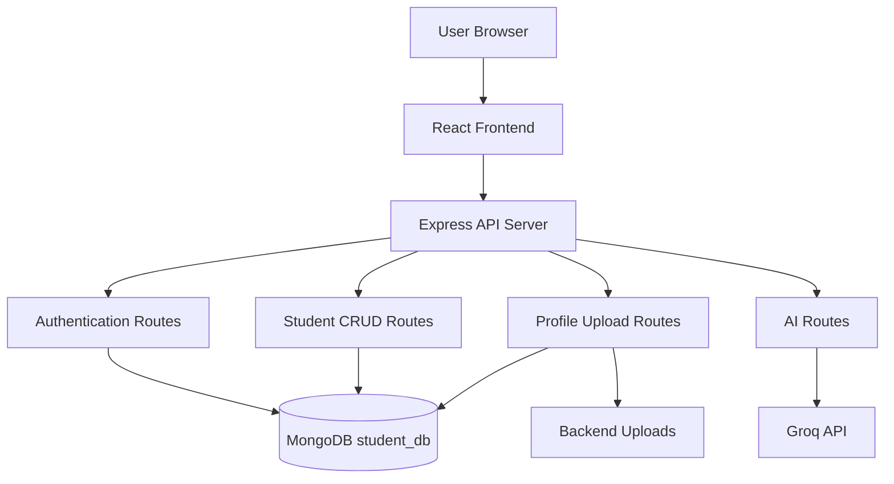
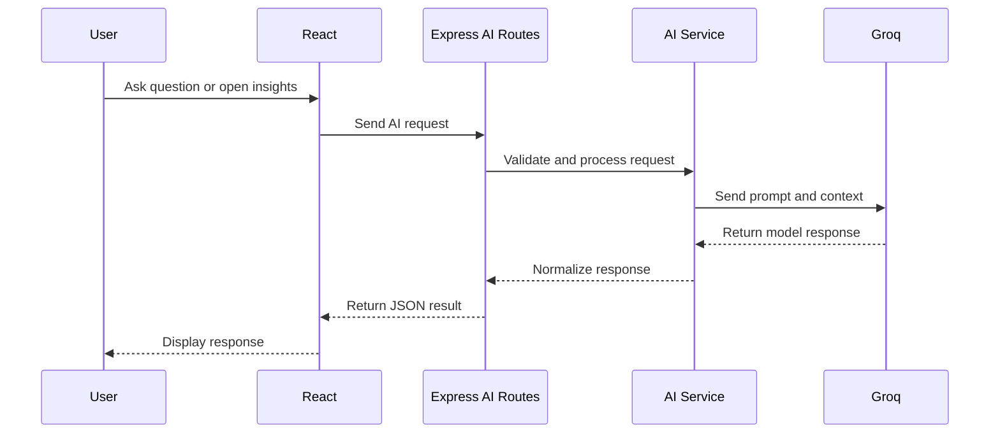

# Rahul Lab Academy Student Portal

A full-stack student registration and operations portal built with React, Express, MongoDB, and Groq Generative AI.

The application supports registration, authentication, profile management, student record administration, file uploads, data exports, dashboards, and AI-powered assistance.

## Contents

- [Problem Statement](#problem-statement)
- [Objectives](#objectives)
- [Features](#features)
- [Architecture](#architecture)
- [System Workflow](#system-workflow)
- [Technology Stack](#technology-stack)
- [Project Structure](#project-structure)
- [API Reference](#api-reference)
- [Data Model](#data-model)
- [GenAI Architecture](#genai-architecture)
- [Setup](#setup)
- [Testing](#testing)
- [Security Notes](#security-notes)
- [Future Improvements](#future-improvements)

## Problem Statement

Educational organizations need a reliable way to register students, store their information, manage profiles, and monitor student operations. A basic form or spreadsheet does not provide centralized storage, authentication, profile management, searchable records, reporting, or intelligent assistance.

This project provides one centralized portal where students can manage their accounts and administrators can manage student records through a dashboard.

## Objectives

1. Provide a simple student registration and login experience.
2. Store student data persistently in MongoDB.
3. Support secure password hashing and password recovery.
4. Provide separate student and administrator dashboard experiences.
5. Support student record CRUD operations.
6. Allow profile customization and image uploads.
7. Provide CSV, PDF, and Microsoft Excel exports.
8. Use GenAI for chat assistance and personalized insights.
9. Provide graceful fallback behavior when AI is unavailable.

## Features

### Authentication

- Student registration
- Login with email and password
- bcrypt password hashing
- Forgot-password email workflow
- Six-digit reset code
- Ten-minute reset-code expiration

### Student Profiles

- View profile information
- Edit name, email, bio, skills, tools, projects, certifications, and roadmap
- Upload profile images
- Delete profile images
- Role-specific profile presentation

### Administration

Administrators can:

- View all student records
- Add student records
- Edit student records
- Delete student records
- View another student's read-only profile
- Search records by name, email, or date
- Export filtered records

Students receive a read-only records experience and do not receive administrator-only management actions.

### Exports

The records view supports:

- CSV download
- Microsoft Excel `.xlsx` download
- PDF report download

Exports contain the currently filtered records and include name, email, MongoDB ID, role, registration date, and status.

### Dashboard UX

- Responsive dashboard layout
- Sidebar navigation
- Loading and empty states
- Toast notifications
- Confirmation dialogs for destructive actions
- Keyboard Escape support for modal dialogs
- Responsive table scrolling
- Consistent action-button alignment

## Architecture

The system uses a client-server architecture:



### Frontend Layer

The React frontend renders forms, dashboards, tables, modals, profile pages, export controls, and AI components.

Primary entry point:

```text
frontend/App.jsx
```

### Backend Layer

The Express server provides JSON APIs, validation, authentication logic, database operations, file upload handling, and AI service integration.

Primary entry point:

```text
backend/server.js
```

### Database Layer

MongoDB stores student accounts and profile information. Mongoose defines the student schema and handles validation and password hashing hooks.

### AI Layer

The frontend sends AI requests to the backend. The backend calls Groq through the SDK. The Groq API key is therefore kept outside browser code.

## System Workflow

### Registration

1. The user submits name, email, and password.
2. React sends `POST /api/register`.
3. Express validates the fields and checks for a duplicate email.
4. Mongoose hashes the password before saving.
5. MongoDB stores the student record.
6. The backend returns a safe student object without the password.
7. The frontend displays a success or error message.

### Login

1. The user submits email and password.
2. React sends `POST /api/login`.
3. The backend finds the account by normalized email.
4. bcrypt compares the submitted password with the stored hash.
5. The backend returns the authenticated student's data.
6. React selects the dashboard based on the user's role.

### Student Management

1. The dashboard requests records from `GET /api/students`.
2. The backend queries MongoDB without returning passwords.
3. React displays the records in the table.
4. Search filtering happens against the loaded records.
5. Admin actions call the create, update, or delete endpoints.
6. The UI refreshes its local state and displays a toast notification.

### Profile Image Upload

1. The user selects an image.
2. React sends a multipart request to `POST /api/profile/image`.
3. Multer validates the MIME type and five-megabyte size limit.
4. The server stores the file with a generated filename.
5. MongoDB stores the image URL in `profileImage`.
6. The frontend displays the updated image.

### Password Reset

1. The user submits an email address.
2. The backend generates a six-digit code.
3. Only a SHA-256 hash of the code is stored.
4. The email service sends the original code.
5. The user submits the code and a new password.
6. The backend validates the hash and expiration time.
7. The password is replaced with a new bcrypt hash.

## Technology Stack

### Frontend

- React 18
- Vite
- React Toastify
- Vitest
- React Testing Library
- SheetJS/XLSX
- jsPDF
- jsPDF AutoTable

### Backend

- Node.js
- Express
- MongoDB
- Mongoose
- bcryptjs
- dotenv
- Multer
- Nodemailer
- Resend
- Groq SDK

## Project Structure

```text
.
├── README.md
├── frontend/
│   ├── App.jsx
│   ├── Login.jsx
│   ├── Registration.jsx
│   ├── package.json
│   ├── vite.config.js
│   └── src/
│       ├── App.test.jsx
│       ├── components/
│       │   ├── AIChatWidget.jsx
│       │   ├── AIInsights.jsx
│       │   ├── DashboardTopbar.jsx
│       │   ├── DeleteConfirmModal.jsx
│       │   ├── LogoutConfirmModal.jsx
│       │   ├── Sidebar.jsx
│       │   ├── StudentModal.jsx
│       │   ├── StudentProfileModal.jsx
│       │   └── DashboardCommon.jsx
│       ├── pages/
│       │   ├── DashboardView.jsx
│       │   ├── StudentsView.jsx
│       │   ├── ActivityView.jsx
│       │   └── Profile.jsx
│       ├── styles/app.css
│       └── utils/dashboardUtils.js
└── backend/
	├── server.js
	├── package.json
	├── models/Student.js
	├── routes/
	│   ├── authRoutes.js
	│   ├── aiRoutes.js
	│   └── profileRoutes.js
	├── services/
	│   ├── aiService.js
	│   └── emailService.js
	└── uploads/
```

## API Reference

### Authentication

```text
POST /api/register
POST /api/login
POST /api/forgot-password
POST /api/reset-password
```

### Student Records

```text
GET    /api/students
POST   /api/students
PUT    /api/students/:id
DELETE /api/students/:id
```

### Profile Images

```text
POST   /api/profile/image
DELETE /api/profile/image
```

### AI

```text
GET  /api/ai/status
POST /api/ai/chat
POST /api/ai/insights
POST /api/ai/search
```

## Data Model

The `Student` model includes:

```text
name
email
password
role
bio
stats
skills
tools
projects
certs
roadmap
profileImage
createdAt
updatedAt
```

Allowed roles are:

```text
student
instructor
admin
```

Passwords, reset codes, and reset-code expiration values are protected from normal student responses.

## GenAI Architecture

The GenAI functionality is organized as a service layer:



### AI Chat

The chat assistant receives the user's message and dashboard context, such as the student name and total student count. The system prompt restricts the assistant to portal-related topics and requests concise responses.

### AI Insights

The service sends a student profile to Groq and requests three actionable insights covering learning, collaboration, and sprint goals. The result is parsed and validated as a JSON array.

### Semantic Search

The semantic search service sends the search query and student names/emails to Groq. Groq returns relevant email addresses, which the backend maps back to full student records.

### GenAI Architect Responsibilities in This Project

The GenAI architect role is represented by the design of the AI subsystem, not by a separate login role. Its responsibilities include:

- Keeping Groq credentials on the backend
- Separating routes from AI business logic
- Designing prompts for specific tasks
- Supplying relevant application context
- Requesting structured output where needed
- Validating model responses
- Providing fallback responses when AI fails
- Making the model configurable through environment variables
- Keeping the frontend independent from the selected AI provider

When `GROQ_API_KEY` is unavailable or a Groq request fails, the application returns demo responses instead of crashing.

## Environment Variables

Create `backend/.env`:

```env
PORT=5000
MONGO_URI=mongodb://127.0.0.1:27017/student_db
GROQ_API_KEY=gsk_your_actual_key_here
GROQ_MODEL=openai/gpt-oss-20b
```

Email-related variables may also be required for password recovery, depending on the selected email provider.

Never commit `.env` files or API keys to source control.

## Setup

#### Vercel deployment

Deploy from the repository root so Vercel uses the root `vercel.json` and installs both the frontend and backend dependencies. The backend can also be deployed as a separate Vercel project with `backend` as its Root Directory; in that case Vercel uses `backend/vercel.json`.

For either setup, add `MONGO_URI` and any other backend secrets in Vercel Project Settings > Environment Variables, then redeploy the current branch. A deployment log mentioning `models/Student.mjs` is from an older or different source tree; the current backend entrypoint is `backend/server.js` and the model is `backend/models/Student.js`.

### Prerequisites

- Node.js 18 or newer
- MongoDB running locally or a MongoDB connection string
- A Groq API key for live AI features

### Install Dependencies

```powershell
cd backend
npm install

cd ../frontend
npm install
```

### Start the Backend

```powershell
cd backend
npm start
```

The backend runs at:

```text
http://localhost:5000
```

### Start the Frontend

```powershell
cd frontend
npm run dev
```

The frontend normally runs at:

```text
http://localhost:5173
```

Start the backend before using database, profile, or AI features.

## Testing

Run the frontend test suite:

```powershell
cd frontend
npm test
```

Build the frontend for production:

```powershell
npm run build
```

The existing tests verify the main student dashboard rendering and role-based admin control visibility. Additional tests should cover modal actions, exports, profile upload behavior, authentication errors, and AI fallback behavior.

## Security Notes

Implemented protections include:

- bcrypt password hashing
- Password removal from normal API responses
- Hashed password-reset codes
- Reset-code expiration
- Duplicate email validation
- MongoDB ObjectId validation
- Image MIME-type validation
- Five-megabyte image limit
- Backend-only Groq API key usage

Before production deployment, add:

- JWT or secure session authentication
- Authentication middleware
- Role-based authorization middleware
- Admin protection for student CRUD routes
- Ownership checks for profile updates and image uploads
- AI rate limiting and input limits
- Request logging and monitoring
- Secure cloud object storage for uploaded files

## Future Improvements

Potential GenAI extensions include:

- AI resume generation
- Personalized learning-roadmap generation
- Course recommendations
- AI project ideas
- Natural-language admin analytics
- AI-generated emails
- Profile quality suggestions
- Student risk detection
- Instructor feedback assistance
- Certificate information extraction

Other platform improvements include:

- Pagination for large student collections
- Server-side search and filtering
- Audit logs for admin actions
- Automated API tests
- Role-based route protection
- Background jobs for AI insights
- Production deployment configuration

## Current Limitations

- The current API routes are not fully protected by authentication middleware.
- Some profile operations rely on a client-provided student ID.
- AI routes are currently publicly reachable.
- Uploaded images use local backend storage.
- The repository contains some older duplicate root-level frontend files; the active Vite application is under `frontend/`.

## Summary

Rahul Lab Academy is a full-stack student operations platform that combines traditional CRUD and authentication features with GenAI assistance. React provides the user experience, Express coordinates API operations, MongoDB stores student data, and Groq powers chat, insights, and semantic search.

The most important architectural principle is the separation between the frontend, backend, database, and AI service. This keeps the AI provider replaceable, protects the API key, allows model responses to be validated, and ensures that the application continues working in demo mode when live AI is unavailable.