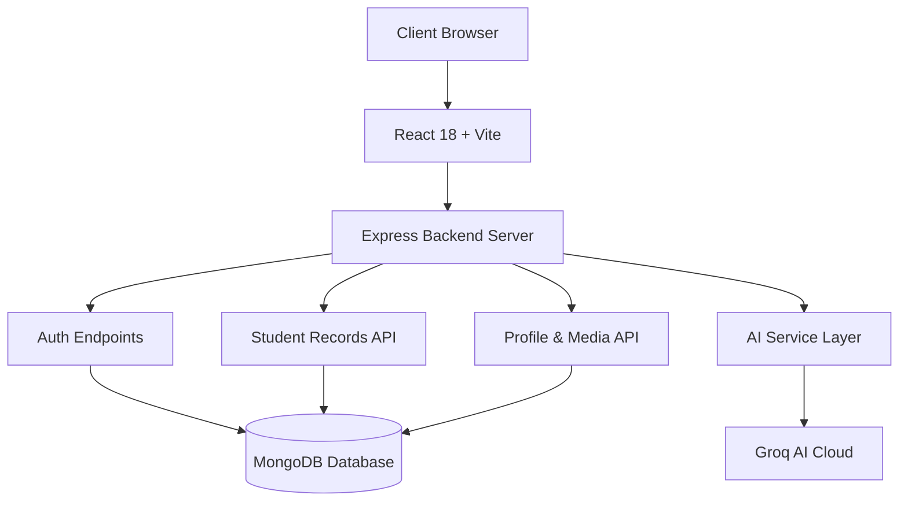

# AI-Enhanced Student Registration and Operations Portal

A modern, full-stack student registration and operations portal built with React, Express, MongoDB, and Groq Generative AI.

The platform provides a unified experience for student onboarding, authentication, profile management, record administration, data exports, real-time analytics, and AI-powered workflow automation.

---

## Table of Contents

- [Problem Statement](#problem-statement)
- [Key Features](#key-features)
- [System Architecture](#system-architecture)
- [System Workflows](#system-workflows)
- [Tech Stack](#tech-stack)
- [Project Structure](#project-structure)
- [API Reference](#api-reference)
- [Data Models](#data-models)
- [GenAI Integration](#genai-integration)
- [Setup & Installation](#setup--installation)
- [Environment Variables](#environment-variables)
- [Testing & Build](#testing--build)
- [Security Measures](#security-measures)
- [Future Scope](#future-scope)

---

## Problem Statement

Educational institutions and training academies often face operational bottlenecks when managing student onboarding via static forms or fragmented spreadsheets. Traditional approaches lack:
- Secure, role-based access control and persistent cloud/database storage.
- Real-time search, filtering, and export capabilities.
- Intelligent guidance, automated profile enhancement, and automated insight generation.

This project delivers an end-to-end portal allowing students to manage their personal profiles and progress, while empowering administrators to perform comprehensive student record lifecycle management and analysis.

---

## Key Features

### 1. Authentication & Security
- Student registration and login workflows.
- Password hashing with bcrypt.
- Password reset functionality with timed verification codes.
- Sensitive credentials strictly isolated on the backend.

### 2. Student Profile Management
- Complete profile customization (Bio, Skills, Tech Stack, Certifications, Learning Roadmap).
- Profile image upload and management.
- Dynamic role-based profile views (Student vs Administrator).

### 3. Record Administration (CRUD)
- View, search, create, update, and remove student records.
- Instant search by Name, Email, or Date.
- Multi-format data exports (CSV, Excel `.xlsx`, PDF reports).

### 4. Interactive Dashboard & Analytics
- Responsive layout with dark/light theme toggle.
- Status metrics, enrollment tracking, and activity logging.
- Toast notifications and modal confirmations.

### 5. Generative AI Capabilities
- **AI Chat Assistant:** Answers portal and curriculum queries in context.
- **AI Profile Insights:** Delivers automated recommendations on skill development and learning paths.
- **Semantic Student Search:** Natural language search mapping queries to matching student profiles.
- **Graceful Fallback:** Operates in offline/demo mode if AI services are unavailable.

---

## System Architecture



---

## System Workflows

1. **Student Registration & Login:** Form submission -> Server validation -> Password hash -> MongoDB persistence -> Safe response (passwords excluded).
2. **Profile Updates:** Profile editing & image uploads handled via Multer with MIME validation and file size restrictions.
3. **AI Services:** Client sends query -> Backend sanitizes input -> Groq API generates contextual responses -> Parsed, validated JSON returned to client.

---

## Tech Stack

- **Frontend:** React 18, Vite, React Toastify, SheetJS (XLSX), jsPDF, Lucide Icons, Tailwind / CSS Modules.
- **Backend:** Node.js, Express.js, Mongoose, Multer, bcryptjs, dotenv.
- **Database:** MongoDB.
- **AI Engine:** Groq SDK (Llama / Mixtral models).

---

## Project Structure

```text
.
├── backend/
│   ├── models/
│   │   └── Student.js
│   ├── routes/
│   │   ├── authRoutes.js
│   │   ├── profileRoutes.js
│   │   └── aiRoutes.js
│   ├── services/
│   │   ├── aiService.js
│   │   └── emailService.js
│   ├── server.js
│   ├── package.json
│   └── .env.example
├── frontend/
│   ├── src/
│   │   ├── components/
│   │   ├── pages/
│   │   ├── styles/
│   │   ├── utils/
│   │   └── App.jsx
│   ├── package.json
│   └── vite.config.js
├── README.md
├── AI_FEATURES.md
└── .gitignore
```

---

## Setup & Installation

### Prerequisites
- Node.js (v18+)
- MongoDB running locally or MongoDB Atlas connection string
- (Optional) Groq API Key for live GenAI features

### 1. Clone Repository
```bash
git clone https://github.com/RAHULRAJPAL75/AI-Enhanced-Student-Registration-Form.git
cd AI-Enhanced-Student-Registration-Form
```

### 2. Backend Setup
```bash
cd backend
npm install
cp .env.example .env
# Configure your MONGO_URI and GROQ_API_KEY in .env
npm start
```
*Backend runs on `http://localhost:5000`*

### 3. Frontend Setup
```bash
cd ../frontend
npm install
npm run dev
```
*Frontend runs on `http://localhost:5173`*

---

## Environment Variables

Copy `.env.example` to `.env` in the backend directory:

```env
PORT=5000
MONGO_URI=mongodb://127.0.0.1:27017/student_db
GROQ_API_KEY=your_groq_api_key_here
GROQ_MODEL=openai/gpt-oss-20b
```

> **Security Note:** Never commit actual `.env` files or production API keys to GitHub.

---

## Security Measures

- **No Exposed Secrets:** All API keys and environment secrets remain on the backend and are ignored by `.gitignore`.
- **Password Security:** Hashed using bcrypt with salt rounds; passwords excluded from API queries.
- **Input Sanitization & Upload Protection:** File type validation and size limits on image uploads.

---

## License

This project is open source and available under the [MIT License](LICENSE).